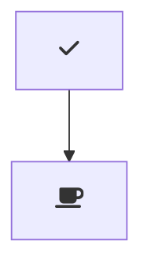

# React Project: Selling Course

---

## 1.Giới thiệu

- Sản phẩm là thành quả của nhóm 2 người là Thành Sang và Tấn Hoàng nhằm mục đích nghiên cứu và học tập
- Đây là website về bán khóa học trực tuyến

- | Công việc | Người Làm | Công Nghệ   |
  | --------- | --------- | ----------- |
  | Frontend  | Sang      | React       |
  | Backend   | Hoàng     | Spring boot |
  | Database  | Hoàng     | MySQL       |

## 2.Khởi tạo

1. git clone https://github.com/thanhsang1999/project_web_2021.git
2. Cài đặt MySQL bằng [Xampp](https://www.apachefriends.org/index.html) tạo database tên là : Course
3. Cài đặt [eclipse](https://www.eclipse.org/downloads/) và import forder CourseBackend
4. Chạy project backend bằng cách chạy file main trong project
5. Chuyển đến phía Frontend bằng cách vào thư mục react
6. Mở Git Bash và chạy lệnh
   > npm start
7. Web được chạy tại
   > [localhost:3000](http://localhost:3000/)
8. Thành Công

- [x] Write the press release
- [x] Update the website
- [ ] Contact the media 

[sang](https://google.com)

```
npm start
dfsf
fsf
``` 




